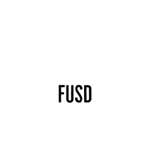

## Sandfuse Lending

We intend to create a P2P lending platform on chain. The general design idea is as follows - 

Proof of Reserve Backed lending protocol.

1. As a user create a loan request with collateral that is backed by a Proof of Reserve
2. The system locks the underlying in a separate vault for each loan taken and mints an NFT representing the balance portion in the underlying - Fuse NFT
3. For the collateral it mints 80% FUSD tokens
4. A keeper liquidates the position by calling the Fuse NFT in case it goes under water
5. The user is free to close the position prior to liquidation
6. The NFT's can be also auctioned off on opensea if the protocol has sufficient tokens to cover the immediate call. Thus earning more protocol revenue
7. The revenue generated is converted to FUSD and funds the lenders
8. We create a token vault and incentivise FUSD-DAI/FUSD-FUSDC liquidity via giving lenders FUSD from revenue

A portion of the fess are auto converted to LINK and paid to the keeper network contract.

There is no token to be created and the system is completely self managed.